# 📐 Tất cả Sơ đồ — Dự án MedAssist AI

---

## 1. BFD — Biểu đồ phân rã chức năng

```mermaid
graph TD
    ROOT["🏥 HỆ THỐNG MEDASSIST AI"]

    ROOT --> A["1. Quản lý Người dùng"]
    ROOT --> B["2. Chat AI - Trợ lý ảo"]
    ROOT --> C["3. Quản lý Hàng đợi"]
    ROOT --> D["4. Lịch sử Khám bệnh"]
    ROOT --> E["5. Quản trị hệ thống"]

    A --> A1["1.1 Đăng nhập bằng Mã BHYT"]
    A --> A2["1.2 Đổi mật khẩu"]
    A --> A3["1.3 Xem thông tin cá nhân & BHYT"]
    A --> A4["1.4 Admin cấp tài khoản bệnh nhân"]

    B --> B1["2.1 Phân tích triệu chứng (PhoBERT)"]
    B --> B2["2.2 Trả lời câu hỏi FAQ"]
    B --> B3["2.3 OCR nhận diện thẻ BHYT (YOLOv8)"]
    B --> B4["2.4 Phát hiện mức độ khẩn cấp"]

    C --> C1["3.1 Bốc số thứ tự khám"]
    C --> C2["3.2 Y tá gọi số tiếp theo"]
    C --> C3["3.3 Chuyển khoa"]
    C --> C4["3.4 Hủy phiếu khám"]

    D --> D1["4.1 Xem danh sách lần khám"]
    D --> D2["4.2 Xem chi tiết lần khám"]
    D --> D3["4.3 Xem đơn thuốc & chi phí"]

    E --> E1["5.1 Quản lý Khoa/Phòng"]
    E --> E2["5.2 Quản lý tài khoản nhân viên"]
    E --> E3["5.3 Cấu hình câu FAQ"]
    E --> E4["5.4 Thống kê & báo cáo"]
    E --> E5["5.5 Xem Logs hệ thống"]

    style ROOT fill:#1a73e8,color:#fff,font-weight:bold
    style A fill:#34a853,color:#fff
    style B fill:#ea4335,color:#fff
    style C fill:#fbbc04,color:#000
    style D fill:#9c27b0,color:#fff
    style E fill:#ff7043,color:#fff
```

---

## 2. Use Case Diagram

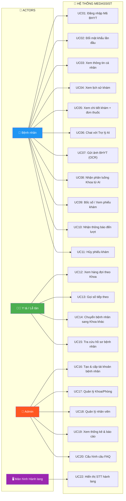

---

## 3. DFD Mức 0 — Context Diagram

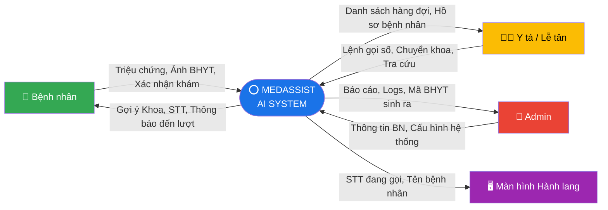

---

## 4. DFD Mức 1 — Luồng 1: Phân tích triệu chứng

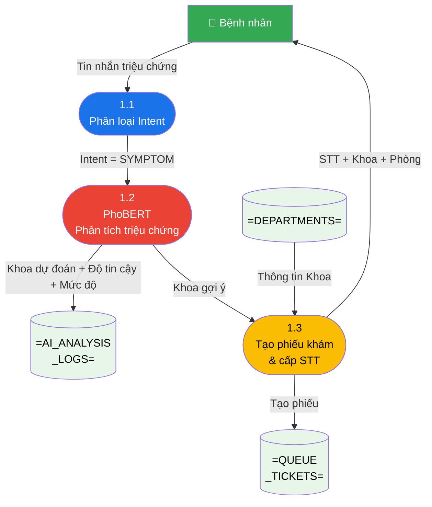

---

## 5. DFD Mức 1 — Luồng 2: OCR thẻ BHYT

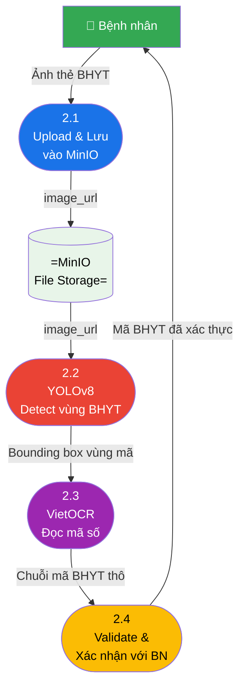

---

## 6. ERD — Biểu đồ thực thể quan hệ

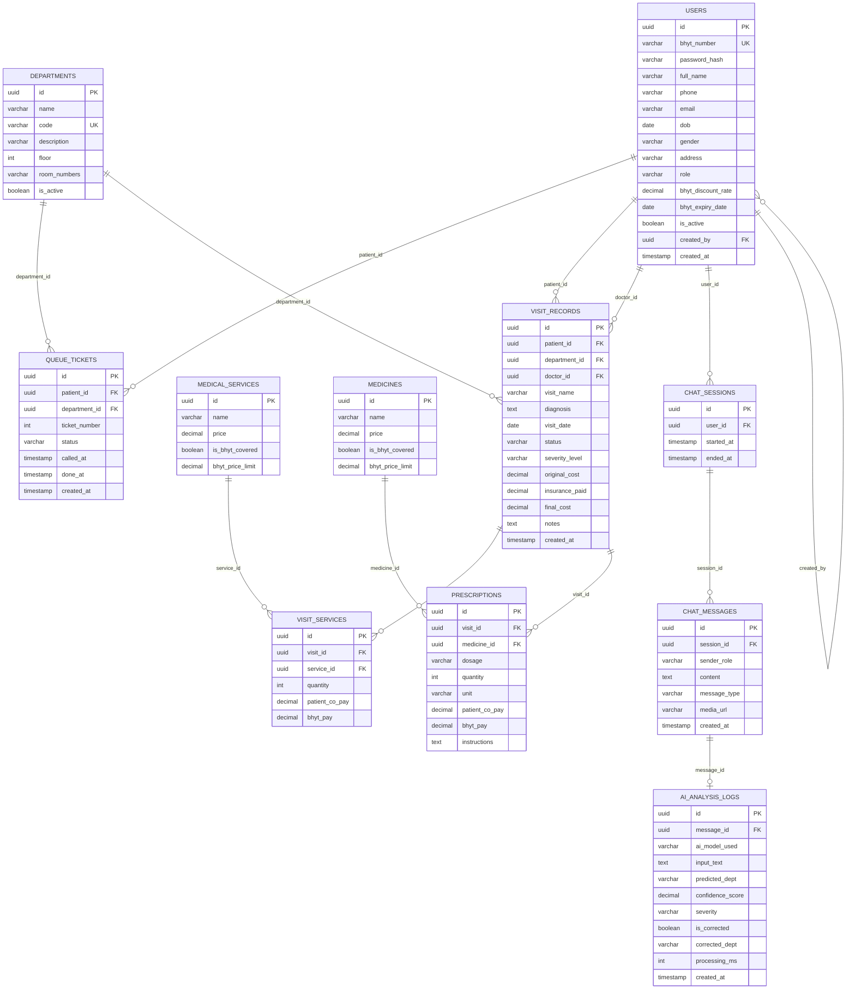

---

## 7. Activity Diagram — Luồng Chat AI phân tích triệu chứng

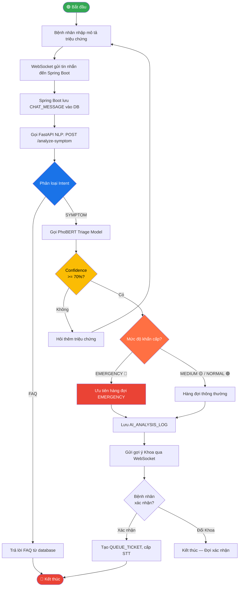

---

## 8. Sequence Diagram — Bệnh nhân gửi triệu chứng → nhận STT

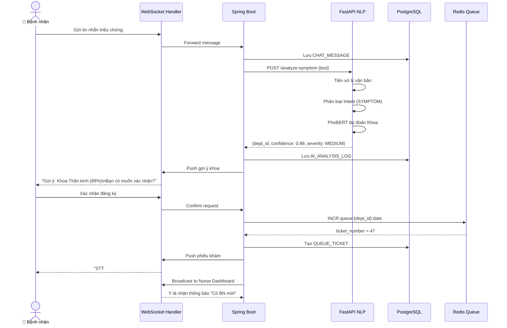

---

## 9. Sequence Diagram — OCR thẻ BHYT

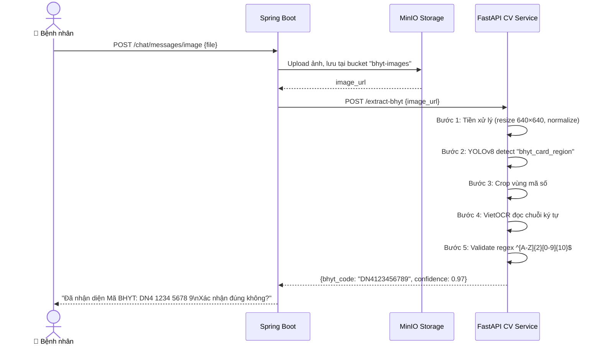

---

## 10. Sequence Diagram — Y tá gọi số

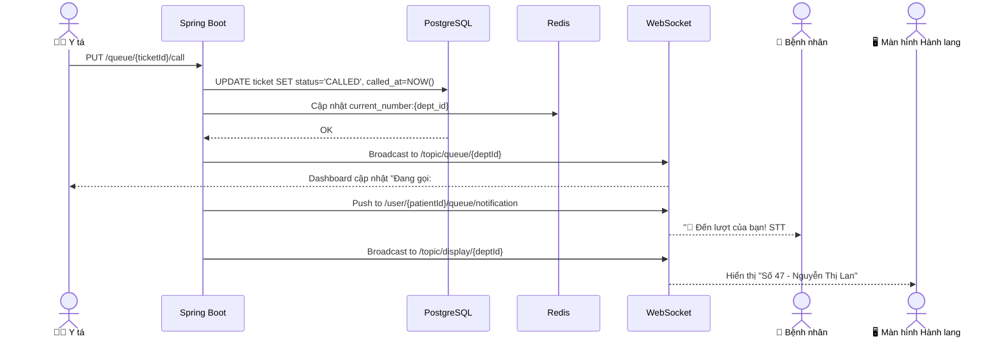

---

## 11. State Diagram — Vòng đời QUEUE_TICKET

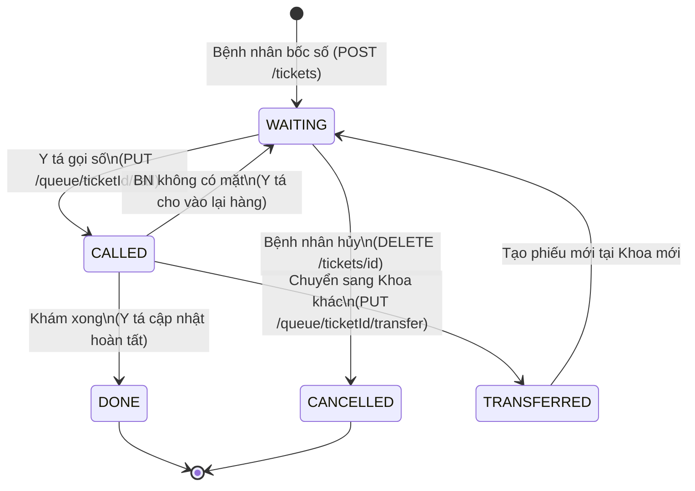

---

## 12. State Diagram — Vòng đời CHAT_SESSION

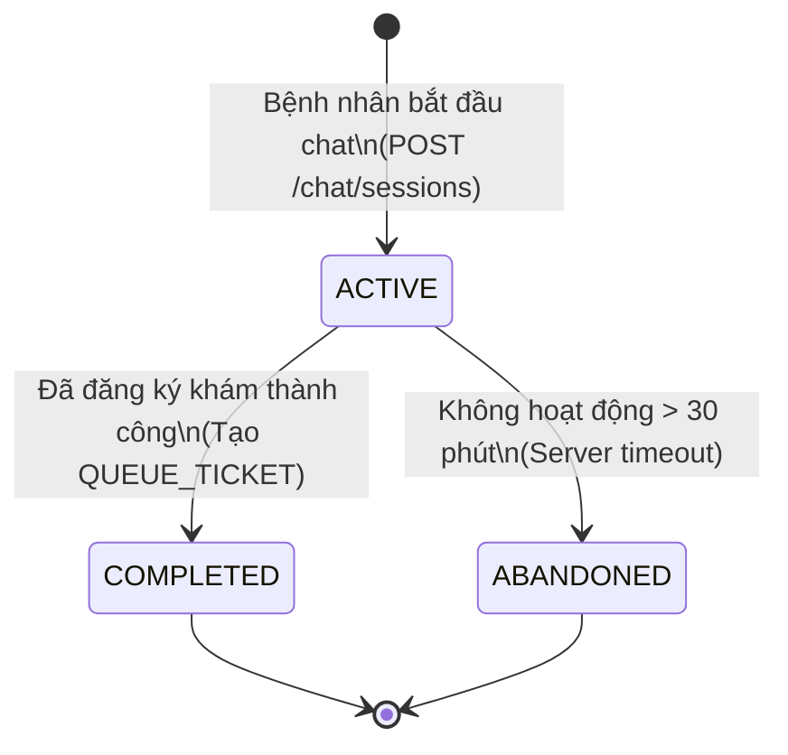

---

## 13. System Architecture Diagram

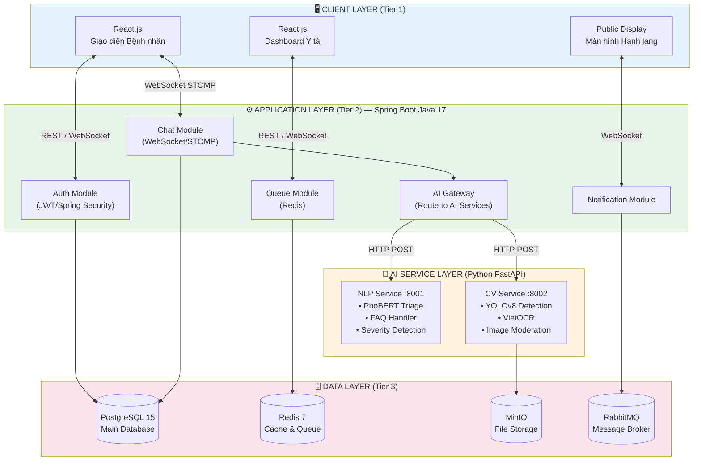

---

## 14. Component Diagram

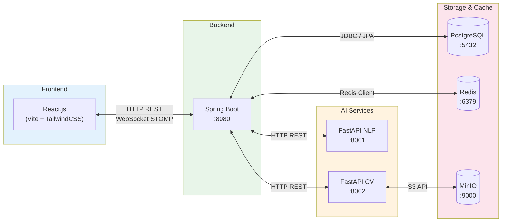

---

## 15. Deployment Diagram

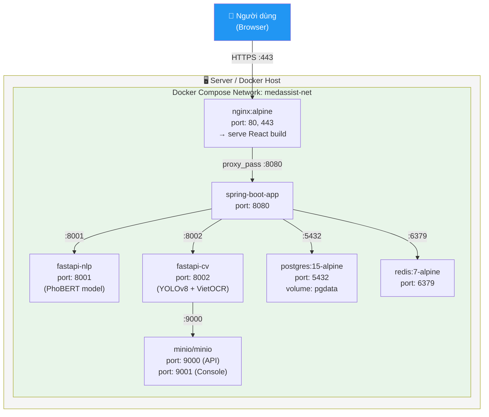

---

## 16. Sitemap — Navigation Flow theo Role

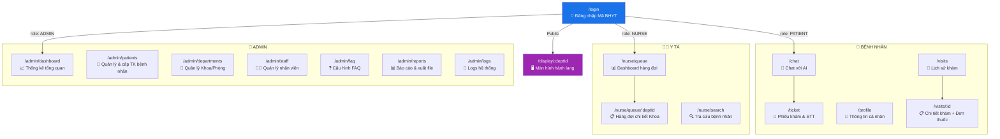

---

## 17. Activity Diagram — Luồng tính Viện phí BHYT

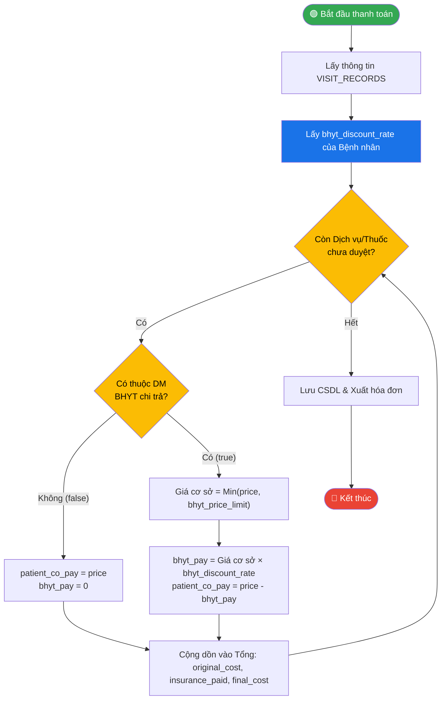
